# CubeArena: The Chess.com for Speedcubing

## Master Product Specification & Startup Design Document

> **Version:** 2.0 | **Date:** June 2026 | **Status:** Pre-Seed / Open Development **Classification:** Public — Suitable for Investors, Contributors, and Community Review

---

## Table of Contents

1. [Executive Summary](https://claude.ai/chat/9c853013-77f1-45e5-addd-ba07e51db9c0#1-executive-summary)
2. [The Chess.com Analogy — And Its Limits](https://claude.ai/chat/9c853013-77f1-45e5-addd-ba07e51db9c0#2-the-chesscom-analogy--and-its-limits)
3. [Project Vision & Core Philosophy](https://claude.ai/chat/9c853013-77f1-45e5-addd-ba07e51db9c0#3-project-vision--core-philosophy)
4. [Competitor Analysis](https://claude.ai/chat/9c853013-77f1-45e5-addd-ba07e51db9c0#4-competitor-analysis)
5. [Market Opportunity](https://claude.ai/chat/9c853013-77f1-45e5-addd-ba07e51db9c0#5-market-opportunity)
6. [Product Pitch](https://claude.ai/chat/9c853013-77f1-45e5-addd-ba07e51db9c0#6-product-pitch)
7. [Feature Specification](https://claude.ai/chat/9c853013-77f1-45e5-addd-ba07e51db9c0#7-feature-specification)
8. [The Verification Problem](https://claude.ai/chat/9c853013-77f1-45e5-addd-ba07e51db9c0#8-the-verification-problem)
9. [Anti-Cheat System](https://claude.ai/chat/9c853013-77f1-45e5-addd-ba07e51db9c0#9-anti-cheat-system)
10. [Match System](https://claude.ai/chat/9c853013-77f1-45e5-addd-ba07e51db9c0#10-match-system)
11. [Rating System](https://claude.ai/chat/9c853013-77f1-45e5-addd-ba07e51db9c0#11-rating-system)
12. [Technical Architecture](https://claude.ai/chat/9c853013-77f1-45e5-addd-ba07e51db9c0#12-technical-architecture)
13. [AI Architecture](https://claude.ai/chat/9c853013-77f1-45e5-addd-ba07e51db9c0#13-ai-architecture)
14. [Database Design](https://claude.ai/chat/9c853013-77f1-45e5-addd-ba07e51db9c0#14-database-design)
15. [API Design](https://claude.ai/chat/9c853013-77f1-45e5-addd-ba07e51db9c0#15-api-design)
16. [Tournament System](https://claude.ai/chat/9c853013-77f1-45e5-addd-ba07e51db9c0#16-tournament-system)
17. [Replay & Statistics](https://claude.ai/chat/9c853013-77f1-45e5-addd-ba07e51db9c0#17-replay--statistics)
18. [Community Features](https://claude.ai/chat/9c853013-77f1-45e5-addd-ba07e51db9c0#18-community-features)
19. [Monetization Strategy](https://claude.ai/chat/9c853013-77f1-45e5-addd-ba07e51db9c0#19-monetization-strategy)
20. [Mobile Experience](https://claude.ai/chat/9c853013-77f1-45e5-addd-ba07e51db9c0#20-mobile-experience)
21. [Risk Analysis](https://claude.ai/chat/9c853013-77f1-45e5-addd-ba07e51db9c0#21-risk-analysis)
22. [Development Roadmap](https://claude.ai/chat/9c853013-77f1-45e5-addd-ba07e51db9c0#22-development-roadmap)
23. [Stretch Goals & Ambitious Future Features](https://claude.ai/chat/9c853013-77f1-45e5-addd-ba07e51db9c0#23-stretch-goals--ambitious-future-features)
24. [Appendix](https://claude.ai/chat/9c853013-77f1-45e5-addd-ba07e51db9c0#24-appendix)

---

## 1. Executive Summary

CubeArena is the competitive infrastructure layer that speedcubing has never had. It is the destination — the place where every cuber worldwide comes to find rated matches, compete in tournaments, track their progress, build a community, and be part of a global competitive ecosystem.

Chess.com grew to 250 million members and over $100 million in annual revenue not by inventing chess, and not by adding a webcam to your board. It grew by building the **platform**: ratings, matchmaking, tournaments, learning tools, social features, spectating, and a beautifully designed product — all wrapped around a game the community was already playing. The game's digital nature made the mechanics easy; Chess.com's genius was in the community and product layer above that.

Speedcubing has an exact equivalent opportunity with one important structural difference: **the solve is physical**. The cube cannot be moved by clicking. This means CubeArena cannot operate on pure digital self-reporting the way Chess.com does. The platform must accommodate verification — either through smart hardware the user already owns, or through webcam-based computer vision as a fallback. But verification is just one component. The larger opportunity is identical to Chess.com's: build the world's best competitive and social platform for an enthusiastic, underserved global community.

The WCA has logged over 265,000 unique official competitors across 165 countries. Tens of millions more solve recreationally. The tools they use today are fragmented, dated, social-less, and competitive-less. CubeArena changes that.

---

## 2. The Chess.com Analogy — And Its Limits

### 2.1 What Chess.com Actually Is

Chess.com is a fully virtual interface. When you play on Chess.com, there is no physical board involved and no webcam pointed at anything. You click pieces on a digital board rendered in your browser. The game is digital end-to-end: your move is a click event, your opponent's move arrives as a server message, and the game state is maintained entirely in software. There is nothing to physically verify because there is nothing physical.

This works for chess because chess is an abstract strategy game. The "playing" of chess is identical whether done on a physical board or a virtual one. The physical board is optional.

### 2.2 Why Speedcubing Is Fundamentally Different

Speedcubing cannot be digitized in the same way. The skill being measured is **physical manipulation speed** — how fast a human's hands can execute a sequence of moves on a physical puzzle. You cannot replicate this digitally. A virtual Rubik's Cube on a screen, solved by mouse clicks, is a completely different and lesser task. The sport is inherently physical, and any platform for it must accommodate that physical reality.

This is both the challenge and the competitive moat for CubeArena. It means:

- You cannot just build a virtual timer and call it done
- The platform must bridge the physical and digital worlds
- Some form of verification is necessary to make competitive results meaningful
- The verification method chosen defines the accessibility of the platform

### 2.3 The Correct Analogy

The right analogy is not "Chess.com with a webcam." The right analogy is this:

> **Chess.com is to chess as CubeArena is to speedcubing — a destination platform built around a pre-existing passionate community, providing the competitive infrastructure, social layer, and content ecosystem that the community lacked.**

The differences from chess are:

- Verification of results requires bridging the physical/digital gap (smart cube hardware or webcam CV)
- Timing precision matters at the millisecond level (chess cares about clock management, not reaction time)
- The primary competitive metric is a continuous variable (solve time) rather than a win/loss outcome

Everything else — ratings, matchmaking, tournaments, leaderboards, clubs, replays, content creators, learning tools, sponsorships, seasonal competition — maps directly from the Chess.com model.

### 2.4 The Verification Hierarchy

CubeArena must support a spectrum of verification methods in order of reliability and accessibility:

| Method                     | Reliability                     | Hardware Cost           | Accessibility                               | Notes                                   |
| -------------------------- | ------------------------------- | ----------------------- | ------------------------------------------- | --------------------------------------- |
| **Smart cube (Bluetooth)** | Highest — move-level tracking   | $50–$150                | Limited — requires purchase                 | GAN i-series, Giiker, etc.              |
| **Webcam CV**              | High — state-based verification | $0 (most users own one) | Broad                                       | CubeArena's primary novel contribution  |
| **Stackmat timer (audio)** | Medium — time only, no state    | $20–$40                 | Moderate (competitive community owns these) | Time is verified, scramble/solve is not |
| **Honor system**           | Lowest — self-reported          | $0                      | Universal                                   | Viable only for casual/unranked play    |

CubeArena's design must accommodate all four tiers, with competitive rankings weighted by verification method used. A solve submitted via smart cube carries more weight than a webcam solve, which carries more weight than a Stackmat-only solve, which carries more weight than a self-reported time.

---

## 3. Project Vision & Core Philosophy

### 3.1 The Vision

To become the world's central hub for competitive speedcubing online — a platform where every cuber, from a beginner doing their first sub-30 to a world-class competitor chasing records, finds a home.

### 3.2 Core Philosophy

|Principle|What It Means in Practice|
|---|---|
|**Fair**|Result integrity scales with verification method; unverified results are clearly labeled|
|**Competitive**|Rated matches, ranked seasons, tournament brackets, live leaderboards|
|**Accessible**|Free tier works with any webcam or even honor mode; premium features for power users|
|**Social**|Friends, clubs, teams, live spectating, replays, community events|
|**Global**|Multi-language UI, worldwide matchmaking, time-zone-aware scheduling|
|**Fun**|Casual modes, daily puzzles, community events, novelty formats, cosmetics|
|**Professional**|Esports-grade tournament infrastructure, broadcast tools, sponsor integrations|
|**Transparent**|Every result clearly labeled with how it was verified|

### 3.3 The Core Insight

Chess.com built a thriving platform around a game that was already fully digital. CubeArena must do the same for a game that is inherently physical — which means the platform design must thoughtfully bridge the gap between a physical puzzle and a digital competitive ecosystem. The verification challenge is real, but it is an engineering problem, not a conceptual blocker. Millions of cubers are already solving physically every day. CubeArena gives those solves a destination.

---

## 4. Competitor Analysis

### 4.1 Platform Profiles

#### CSTimer (cstimer.net)

**Core Functionality:** Browser-based timer supporting all WCA events. Advanced session management, statistical tracking, scramble generation using WCA-standard random-state algorithms, BLD tools, and analysis. Widely considered the gold standard for solo practice.

**User Base:** The most-used speedcubing timer in the world. No official user count, but community consensus and Similarweb rankings place it as the dominant practice tool among serious competitors globally.

**Pricing:** Free and open-source.

**Strengths:**

- Industry-standard random-state scramble generator for 3x3 — the WCA community trusts this
- Supports every WCA event and dozens of unofficial events
- Lightweight, offline-capable, highly customizable
- Trusted by top competitors worldwide; used at practice sessions before official WCA competitions

**Weaknesses:**

- No multiplayer of any kind — purely a solo timer
- No account system; data lives in browser local storage (no cross-device access)
- No social features whatsoever
- Dated visual design
- No verification of any kind — entirely trust-based

**Missing Features:** Everything competitive, everything social, everything multiplayer.

**Community Complaints:** No account persistence, clunky mobile experience, high learning curve for new users, no way to compete against others in-platform.

**Opportunity:** CSTimer owns the "practice timer" category completely but leaves the entire "competitive platform" category open. CubeArena does not need to replace CSTimer — it sits above it in the product stack, providing the destination that cubers go to after practicing on CSTimer.

---

#### CubeDesk (cubedesk.io)

**Core Functionality:** Modern browser/desktop timer with account system, session tracking, algorithm trainer, 1v1 head-to-head races (honor-system, no verification), leaderboards, statistics, Elimination mini-game.

**User Base:** Tens of thousands of registered accounts. Self-described as "one of the biggest cubing communities online," though the active competitive user base is much smaller.

**Pricing:** Freemium — Pro membership unlocks UI customization and additional features.

**Strengths:**

- The best UI in the speedcubing timer space by wide community consensus
- Account system enables cross-device persistence and public profiles
- 1v1 races give a taste of competitive online cubing
- csTimer data import for onboarding
- Algorithm trainer built in

**Weaknesses:**

- 1v1 matchmaking wait times are a major community complaint — users report sitting through an entire ao100 practice session without finding a match
- 3x3 only in competitive modes
- Uses random-move scrambles rather than WCA-standard random-state, a persistent community criticism
- Entirely honor-based — no verification of any kind; results can be fabricated
- No tournaments, no seasonal rankings, no structured competitive play
- Leaderboards are unverified and therefore not taken seriously

**Missing Features:** Verification, fast matchmaking, multi-event support, tournaments, replays, spectating.

**Community Complaints:** Broken matchmaking. Scramble quality questions. Leaderboard integrity. Limited event support.

**Opportunity:** CubeDesk proved demand for a social cubing platform but lacked the user density and verification to make it feel real. CubeArena inherits this concept and builds it out properly.

---

#### CubingTime (cubingtime.com)

**Core Functionality:** Self-described "first speedcubing social network." Virtual rooms for group solving, weekly competitions, basic timer, mobile app. Entirely trust-based result submission.

**User Base:** Small but active. Ranked 5th among cubing timer sites (Similarweb, April 2026).

**Pricing:** Free with optional premium tier.

**Strengths:**

- Group/room-based model creates a social atmosphere
- Weekly competitions provide regular engagement
- Mobile app available

**Weaknesses:**

- Entirely trust-based; the site's own documentation notes that extraordinary times "may not be real"
- Cheating in weekly competitions is a documented, widespread community complaint
- Small user base limits competitive depth
- Dated design
- No verification, no structured tournament infrastructure

**Missing Features:** Verification is the whole product gap. Without it, the competitive layer is meaningless.

**Community Complaints:** Rampant cheating. Top times are not trusted. Thin matchmaking.

**Opportunity:** The social concept is right. The execution is wrong because no one trusts the results.

---

#### GAN CubeStation

**Core Functionality:** Mobile app (iOS/Android) paired with GAN Bluetooth smart cubes. Real-time move tracking via onboard sensors, online 1v1 and group battles, algorithm trainer, move analytics, TPS tracking, replay, online competitions with prize pools. Also supports normal cubes (honor-based), virtual cubes (on-screen), and Bluetooth timers.

**User Base:** Over 1 million cubers on the CubeStation app. GAN claims millions of smart cube sales globally. Tens of thousands of daily active users in competitive modes.

**Pricing:** App is free; smart cube hardware costs $50–$150+ depending on model (GAN i4, iCarry series, etc.).

**Strengths:**

- The only platform with robust hardware-verified solve data (move-level tracking via onboard gyroscope and sensors)
- Full move analytics: TPS, rotation count, phase timing, efficiency — no other platform matches this
- Active competition calendar with real prize pools
- Large and growing install base
- Actually works: the smart cube hardware side is genuinely impressive

**Weaknesses:**

- The premium experience requires GAN hardware — a significant cost barrier for most cubers globally
- App quality complaints are consistent: poor English localization, bugs, connectivity issues
- Ecosystem lock-in: competitors using QiYi, MoYu, or other brands are excluded from the highest fidelity experience
- The "normal cube" and "virtual cube" modes fall back to honor-based timing, which undermines the platform's competitive credibility for those users
- CubeStation is fundamentally a GAN product marketing vehicle; its interests are aligned with selling hardware, not building the best possible open platform

**Missing Features:** Hardware-agnostic high-quality verification, polished English UX, neutral brand positioning, open ecosystem.

**Community Complaints:** Requires GAN purchase for real competitive experience. App bugs and localization issues. Connectivity problems with Bluetooth. The non-GAN cube experience is a second-class product.

**Opportunity:** CubeStation proves hardware-verified online competition is viable and desirable. CubeArena positions itself as the neutral, open alternative — brand-agnostic, accessible at multiple price points, with a better product for the broader community.

---

#### WCA Live (live.worldcubeassociation.org)

**Core Functionality:** Competition management platform for in-person WCA events. Round management, result entry, real-time rankings during events, competitor progression tracking. Integrates with WCA database via WCIF format.

**User Base:** Every WCA competition organizer and official competitor — the global governing body's operational tool.

**Pricing:** Free, open-source.

**Strengths:**

- Official WCA integration — only platform feeding directly into official records
- Battle-tested at hundreds of competitions annually
- GraphQL API for real-time updates
- Open-source and community-maintained

**Weaknesses:**

- Designed exclusively for in-person WCA events
- Zero online competition capability by design
- No matchmaking, rating system, or social features
- Not built for daily use — event management tool only

**Opportunity:** WCIF data format integration could allow CubeArena to optionally display a user's official WCA profile alongside their CubeArena record. Positioning CubeArena as a complement to the WCA's infrastructure, not a competitor to it.

---

#### CubingContests (cubingcontests.com)

**Core Functionality:** Unofficial competition hosting for events not recognized by WCA (unofficial events, extreme BLD, submitted-result formats). WCA account login integration.

**User Base:** Niche, primarily BLD and unofficial event specialists.

**Pricing:** Free, donation-supported.

**Strengths:**

- Fills a genuine gap for non-WCA events
- WCA account integration provides authentication continuity
- Good for tracking unofficial records

**Weaknesses:**

- No real-time online competition
- Submitted results are mostly trust-based (some require video evidence submitted externally)
- Very small community

**Opportunity:** CubeArena could serve as the verification layer for CubingContests' video evidence requirements, or as a partner platform for online divisions of unofficial events.

---

#### QQTimer (qqtimer.net)

Barebones browser timer. No accounts, no multiplayer, no community. Used by casual cubers who want zero-friction timing. Not a competitive threat. Represents top-of-funnel users who are potential CubeArena casual-mode converts.

---

#### Twisty Timer (Android)

Mobile timer app. Good UX, offline capable, WCA-standard scrambles, Android-only. No online features. Its users are the primary mobile acquisition target for CubeArena's native app.

---

### 4.2 The Critical Insight From Competitor Analysis

Every existing platform fails at one or more of:

- **Verification** (CSTimer, CubeDesk, CubingTime, QQTimer — all honor-based)
- **Accessibility** (CubeStation — requires expensive proprietary hardware)
- **Competitive depth** (all except CubeStation — no ratings, no tournaments, no seasons)
- **Community** (all — none have a fully realized social layer)
- **Platform neutrality** (CubeStation is a GAN product; not independent)

CubeArena's opportunity is to build the neutral, accessible, fully-featured competitive platform that the community does not yet have.

### 4.3 Competitor Comparison Matrix

|Platform|Verification|Multiplayer|Tournaments|Rating|Replays|Mobile|Social|Cost|Brand-neutral|
|---|---|---|---|---|---|---|---|---|---|
|CSTimer|❌ None|❌ None|❌ None|❌|❌|⚠️ Poor|❌|✅ Free|✅|
|CubeDesk|❌ None|⚠️ 1v1 only|❌|❌|❌|⚠️ Limited|⚠️ Basic|✅ Free/Pro|✅|
|CubingTime|❌ Trust|✅ Group rooms|⚠️ Weekly|❌|❌|✅ App|⚠️ Basic|✅ Free|✅|
|CubeStation|✅ Smart cube|✅ Full|✅ Prizes|✅|✅|✅ Native|⚠️ Basic|❌ Hardware req.|❌ GAN only|
|WCA Live|N/A (in-person)|❌|✅ Official|N/A|❌|✅|❌|✅ Free|✅|
|**CubeArena**|**✅ Tiered**|**✅ Full suite**|**✅ Full**|**✅ Glicko-2**|**✅**|**✅**|**✅ Full**|**✅ Free+Premium**|**✅**|

---

## 5. Market Opportunity

### 5.1 Why Speedcubing Hasn't Had Its Chess.com Moment

Chess had a 30-year head start in digital form — online chess servers existed in the 1980s, and chess became fully digital almost immediately after computers appeared. Chess.com was not building something that required a new technical breakthrough; it was refining and centralizing an already-digital game.

Speedcubing's path to a central online platform was blocked by a single structural problem: **the competition happens on a physical object.** Until recently, you could not get verified competitive results from a physical cube solve without expensive proprietary hardware. The options were:

- Trust the solver (honor system — exploitable)
- Buy a smart cube (expensive, ecosystem-fragmented, GAN-proprietary)
- Submit video evidence (asynchronous, labor-intensive to review, not real-time)

None of these solutions were good enough to build a Chess.com-equivalent platform on. That barrier is now lifting — smart cubes are becoming more affordable, webcam CV is newly viable at the required accuracy, and the community is large enough to sustain a standalone platform. The timing is right.

Additional structural reasons the market has lagged:

- The WCA community is volunteer-led with no mandate to build for-profit digital products
- Smart cube ecosystems were fragmented and proprietary (GAN, Giiker, MoYu using incompatible Bluetooth protocols)
- The community historically defined "real competition" as in-person WCA events — a cultural barrier as much as a technical one
- No Chess.com-equivalent viral moment (Queen's Gambit drove a massive Chess.com wave in 2020; speedcubing's crossover moment has not yet arrived)

### 5.2 Current Pain Points

From Reddit (r/Cubers, r/Speedcubing), SpeedSolving.com, and community Discord servers:

- No way to find a rated match against a stranger with any result integrity
- CubeDesk's matchmaking is functionally broken (extreme wait times)
- Smart cube competition requires buying a $50–$150 GAN product with a mediocre app
- Online competitions either require video evidence (slow, labor-intensive) or are fully honor-based (untrusted)
- No online rating system the community respects or uses consistently
- No equivalent of Chess.com's learning system, daily puzzle, or coaching infrastructure
- Clubs and schools that run Rubik's Cube programs have no digital home

### 5.3 Market Size

**Total Addressable Market:**

- Over 265,000 competitors have competed in official WCA events across 165 countries
- The broader active cubing community is estimated at 5–10 million globally
- The Rubik's Cube market was valued at approximately $777M in 2025, growing ~4–5% CAGR
- The speed cube segment specifically is projected at ~$90M by 2032

**Serviceable Addressable Market:**

- Active cubers who want structured online competition: estimated 500,000–1,000,000 globally
- This is the initial target — comparable in size to Chess.com's user base in its early years

**Serviceable Obtainable Market:**

|Year|Registered Accounts|Monthly Active|
|---|---|--:|
|Year 1|50,000|8,000|
|Year 2|200,000|35,000|
|Year 3|750,000|120,000|
|Year 5|3,000,000|400,000|

**Proxy: Chess.com's growth trajectory** Chess.com grew from ~2M members in 2012 to 250M by 2026. The Queen's Gambit Netflix premiere in 2020 alone caused a 3× traffic spike and drove millions of new signups in weeks. Speedcubing's equivalent viral moment — a major YouTube video, a streamer adoption, a high-profile live event — has not yet happened. CubeArena needs to be ready when it does.

### 5.4 Growth Opportunities

- **Content creators:** Top cubing YouTubers (J Perm with 1.5M subscribers, Feliks Zemdegs, SpeedCubeReview) are natural amplifiers. The Chess.com/Hikaru Nakamura streaming relationship model — where a top competitor streams on the platform and drives enormous viewer sign-ups — applies directly.
- **School and club programs:** Rubik's Cube clubs are active in US, UK, and Asian secondary schools. CubeArena provides competitive infrastructure they currently lack entirely.
- **Smart cube ecosystem growth:** As Bluetooth-enabled cubes become more mainstream and drop in price, CubeArena's smart cube integration tier becomes more accessible. Rather than competing with GAN, CubeArena can be the neutral platform that supports all smart cube brands.
- **Esports convergence:** Chess.com's $1M Global Championship demonstrates that mind/dexterity sports can achieve mainstream esports production values. Speedcubing's combination of athleticism, visual drama (watching a cube scrambled and solved in seconds), and accessible rules makes it well-suited for esports presentation.

### 5.5 Business Models

| Model                 | Chess.com Analog         | CubeArena Application                                            |
| --------------------- | ------------------------ | ---------------------------------------------------------------- |
| Premium subscription  | Diamond/Platinum tiers   | Core monetization — advanced stats, replay storage, multi-event  |
| Cosmetics             | Board themes, piece sets | Timer skins, profile customization, avatar frames                |
| Tournament entry fees | N/A                      | Organizer-set fees for prize events; platform takes 10%          |
| Hardware affiliate    | N/A                      | Smart cube affiliate partnerships (GAN, QiYi, MoYu, The Cubicle) |
| Sponsorships          | N/A                      | Branded tournaments from hardware companies                      |
| B2B educational       | Chessable licensing      | School/club institutional accounts                               |
| API licensing         | Chess.com API            | Long-term — third-party tool integration                         |

---

## 6. Product Pitch

### 6.1 The Problem

The Rubik's Cube is the most recognizable puzzle in human history. Hundreds of millions have been sold. Tens of millions of people can solve it. Hundreds of thousands compete in official WCA events across 165 countries. Top competitors are solving in under 5 seconds.

And yet: there is nowhere on the internet today where a competitive cuber can go, find a rated match against a similarly-ranked opponent within a minute, have both results verified, and walk away with a meaningful rating update and a replay to analyze.

The tools that exist are:

- **Solo practice timers** (CSTimer, CubeDesk) — great for personal training, useless for competition
- **Honor-based 1v1 platforms** (CubeDesk races, CubingTime) — results are unverified and widely untrusted
- **Proprietary smart cube ecosystem** (GAN CubeStation) — requires buying a $50–$150 GAN product; the best competitive experience in the market but locked behind hardware and tied to one brand

There is no neutral, accessible, competitive home for speedcubing online.

### 6.2 The Solution

CubeArena is the competitive platform and social community that speedcubing has been missing.

The platform supports multiple ways of participating, depending on what hardware you have:

- **Smart cube (Bluetooth):** Connect your GAN, Giiker, or QiYi smart cube. CubeArena reads your moves in real-time via Bluetooth. Your scramble is verified move-by-move. Your solve is timed to the millisecond. This is the highest-integrity tier.
    
- **Webcam:** No smart cube? Point your webcam at your cube. CubeArena's computer vision reads the cube's color state at the start and end of your solve. Scramble is verified before you start; solved state is confirmed when you finish. Accessible to anyone with a laptop webcam.
    
- **Stackmat timer:** Have a physical Stackmat from your competition kit? Connect it via audio jack (the existing CSTimer method). Your time is hardware-verified. Scramble adherence is webcam-confirmed if the webcam is also active.
    

In every mode, CubeArena provides:

- Rated matchmaking (Glicko-2 rating system)
- WCA-standard random-state scrambles
- Synchronized live races against opponents
- Post-match replays
- Tournament infrastructure
- A social layer: friends, clubs, leaderboards, spectating, seasonal competition

This is what Chess.com built for chess. CubeArena builds it for speedcubing.

### 6.3 Why Now

Four things converge in 2026:

**Smart cube accessibility:** GAN's iCarry and i4 series have brought Bluetooth smart cubes to a broader price range (~$50–$80). The technology is no longer exotic. Hundreds of thousands of cubers already own one.

**Computer vision maturity:** YOLOv8 achieves near-perfect precision on real-time object detection. Rubik's Cube state detection is a well-studied problem with strong recent research results. A webcam-based verification system is now viable at consumer hardware quality.

**Community size:** The WCA's 265,000 official competitors, plus millions of recreational cubers, have reached critical mass for a dedicated competitive platform. CubeDesk's partial solution attracted tens of thousands of users even with broken matchmaking, proving pent-up demand.

**No dominant neutral platform:** CubeStation is hardware-locked and brand-tied. Everyone else is either a solo timer or an honor system. The neutral competitive platform position is unoccupied.

### 6.4 The Long-Term Vision

**Year 1:** The go-to destination for online competitive cubing. Fast matchmaking, trusted results, a rating system the community respects.

**Year 2:** The platform for organized community and institutional cubing. Clubs, schools, seasonal competition, tournaments with real prizes.

**Year 3:** An emerging esport. Top cubers streaming on CubeArena. Sponsor integration. Cash Grand Prix events. Creator tools. A growing community of spectators who don't cube but love watching.

**Year 5:** The governing partner of choice for online speedcubing globally. Potentially the official platform for WCA-recognized online divisions. A household name in competitive puzzles.

### 6.5 Target Audiences

**Competitive cubers (Age 14–28, core user):** They practice daily on CSTimer and want somewhere to test themselves against real rated opponents. They drive organic growth through community word-of-mouth. They are the product's validators — if they trust it, everyone will.

**Casual cubers (Age 12–40):** Can solve the cube but don't attend WCA events. Want a fun, low-stakes place to race friends or strangers. Drive volume.

**Clubs and schools:** Need competitive infrastructure. CubeArena provides club accounts, inter-club tournaments, institutional leaderboards, and teacher dashboards.

**Tournament organizers:** WCA and unofficial event organizers can use CubeArena's tournament system to run online brackets, dramatically reducing the overhead of video-evidence review.

**Hardware brands (GAN, QiYi, MoYu, The Cubicle, SpeedCubeShop):** Want engaged cubing audiences for sponsored events and affiliate revenue.

**Content creators:** Top cubing YouTubers can run audience tournaments, head-to-head exhibitions, and live competitive content with CubeArena's broadcast tools.

---

## 7. Feature Specification

### 7.1 MVP Features

The MVP must prove exactly one thing: **verified, rated, live 1v1 speedcubing races work, and people want them.** Everything else is secondary until this is validated.

#### 7.1.1 Account System

- Email/password registration
- OAuth via Google and Discord (where the community lives)
- Username, avatar, country, WCA ID (optional — for pre-population of official personal bests)
- Public profile: rating history, solve history, achievements, stats, verification tier badge
- Account settings: privacy controls, notification preferences, preferred event, hardware type

#### 7.1.2 Multi-Tier Solve Verification

_[See full specification in Section 8.]_

The platform supports three verification tiers, each clearly labeled on all results:

**Tier 1 — Smart Cube (Verified+)**

- Bluetooth connection to compatible smart cube (GAN i-series, Giiker M3, QiYi AI initially)
- Move-by-move tracking; scramble verified at the move level before timer starts
- Solve completion detected by solved state reaching the sensors
- Highest integrity tier; eligible for all leaderboards and records

**Tier 2 — Webcam CV (Verified)**

- Standard webcam pointed at cube during solve
- Computer vision reads cube color state to confirm scramble, then confirm solved state
- No hardware purchase required; works with any laptop/desktop webcam
- Eligible for all rated play; not eligible for world record leaderboard without additional review

**Tier 3 — Honor Mode (Unverified)**

- Self-reported times with no hardware verification
- Available for casual modes, private rooms, and practice
- Clearly labeled as "Unverified" on all results
- Not eligible for rated matchmaking (only casual modes)

#### 7.1.3 Scramble Generation

- WCA-standard random-state generator for 3x3 — the community gold standard, distinguishes CubeArena immediately from CubeDesk's random-move generator
- Scramble delivered server-side, timestamped, signed
- For smart cube users: scramble loaded into the cube tracking system; scramble adherence verified move-by-move
- For webcam users: scramble rendered as both move notation and animated 3D preview; CV confirms the scrambled state before timer starts
- Scramble seeds logged server-side; cannot be pre-computed by client

#### 7.1.4 1v1 Ranked Matchmaking

- Quick-play ranked queue (Tier 1 and Tier 2 players matched separately within their tier; cross-tier matching possible after 90 seconds with clear labeling)
- Rating band matching: ±150 points within 30s, ±300 after 45s, open bracket after 60s
- Match lobby: both players see opponent rating, country, verification tier, recent average
- Pre-match countdown: synchronized inspection window (15 seconds optional, matching WCA format)
- Live race: timer synced server-side; both streams visible to each other (WebRTC P2P when possible)
- Post-match: rating change, replay link, rematch option

#### 7.1.5 Casual 1v1 Matchmaking

- Same infrastructure, no rating impact
- All verification tiers including honor mode
- Available as guest (5 matches before registration required)

#### 7.1.6 Private Rooms

- Create a room with a shareable link/code
- Supports 2–10 players in simultaneous races
- Host controls: event, inspection time, solve count, format (best of N / fixed N)
- Persistent room codes for recurring groups
- Optional honor mode for casual friend groups without hardware

#### 7.1.7 Glicko-2 Rating System

_[See full specification in Section 11.]_

- Separate rating pools per verification tier (Tier 1 and Tier 2 pool into a single "Verified" pool; Tier 3 is casual-only)
- Initial rating 1000, high RD (rating deviation), settles over first 10 matches
- Rating history chart
- Provisional badge for first 10 matches

#### 7.1.8 Solve Replay System

_[See full specification in Section 17.]_

- Every rated solve produces a replay: timestamps, verification data, webcam clip (if applicable), smart cube move log (if applicable)
- Share via public link
- Replay stored 90 days (free), 1 year (premium)

#### 7.1.9 Personal Statistics

- All-time best single and Ao5, Ao12, Ao50, Ao100 across verification tiers
- Rolling averages over time (chart)
- Win/loss rate, rating history, best/worst by opponent rating tier
- Improvement trend (week-over-week)

#### 7.1.10 Social Foundations

- Friends, friend requests, online presence indicator
- Activity feed: friend PBs, rating milestones, tournament results
- Basic notifications: friend requests, match invites, tournament reminders

#### 7.1.11 Leaderboards

- Global leaderboard by Glicko-2 rating (Tier 1 and Tier 2 combined Verified pool)
- Country leaderboard
- Weekly fastest verified single (top 10 manually reviewed)
- Separate casual leaderboard for honor-mode users (clearly labeled unverified)

---

### 7.2 Version 2 Features

#### 7.2.1 Multi-Event Support

Extending to additional WCA events with appropriate verification adaptations:

- 2x2x2 (highest priority — fast, popular, webcam CV well-suited)
- 4x4x4 (smart cube tier only initially; CV is harder due to sticker density)
- Pyraminx (custom CV training required for non-cube geometry)
- Skewb
- Megaminx (long solves — adjusted match pacing)

Each event has its own Glicko-2 pool.

#### 7.2.2 Smart Cube Ecosystem Expansion

- Cross-brand smart cube protocol support: GAN, Giiker/Xiaomi, QiYi AI, MoYu AI
- CubeArena Bluetooth Bridge: lightweight browser/Electron app handling Bluetooth pairing (since browser Bluetooth API has device restrictions)
- Each brand's cube tracks moves differently; CubeArena's bridge normalizes to a common move notation format

#### 7.2.3 Tournament Brackets

- Swiss system, single elimination, double elimination, round robin
- In-platform registration, seeding, scheduling, bracket display
- Automated progression from verified results
- Dispute system: flag a result, attach replay, moderator queue

#### 7.2.4 Clubs

- Club creation, captain/officer roles, club leaderboard
- Inter-club challenges and tournaments
- Club activity feed, club practice rooms

#### 7.2.5 Spectator Mode

- Live view of ongoing ranked matches with 15-second delay
- Spectator chat
- Featured matches surfaced by rating (top-ranked matchups highlighted)

#### 7.2.6 Voice Chat

- WebRTC audio in private rooms and club sessions
- Push-to-talk or open mic

#### 7.2.7 Seasonal Rankings

- 90-day seasons with separate rating pools
- Top performers receive permanent season badges
- End-of-season announcement and cosmetic rewards

#### 7.2.8 Advanced Replay Analysis

- Frame-by-frame playback with CV overlay (for webcam solves)
- Move-by-move playback with 3D cube reconstruction (for smart cube solves)
- AI-estimated phase breakdown: Cross / F2L / OLL / PLL timestamps
- TPS curve (from smart cube move data)
- Side-by-side solve comparison

#### 7.2.9 AI Coaching Module

- Phase timing comparison against peers at the same rating
- Weak phase identification: "Your OLL recognition averages 1.2s above peers at your rating level"
- Algorithm recommendations from open algorithm database
- Requires smart cube data or high-accuracy CV phase detection

#### 7.2.10 Mobile App

_[See Section 20.]_

---

### 7.3 Future Vision Features

#### 7.3.1 Professional Leagues

- Invited top-rated players; scheduled seasons; broadcast production
- Esports-grade overlay, commentator tools, replay highlights

#### 7.3.2 Cash Tournaments

- Legal compliance per jurisdiction
- Escrow-based prize pools
- Identity verification for prize distribution

#### 7.3.3 WCA Integration

- Optional WCA OAuth: link CubeArena profile to official WCA account
- Display official PBs and WCA ranking as profile context (distinct from CubeArena rating)
- CubeArena positioned as complement to WCA, not replacement

#### 7.3.4 Creator Tools

- Custom tournament creation with creator branding
- One-click Twitch/YouTube overlay integration
- Audience participation modes

#### 7.3.5 Fantasy Cubing

Draft real cubers, score from WCA results and CubeArena Pro League performance.

#### 7.3.6 Educational Platform

Structured learning paths, video lessons, progress tracking, B2B school licensing.

---

## 8. The Verification Problem

This is CubeArena's most novel engineering challenge. Chess.com never had to solve it — chess is already digital. CubeArena must bridge physical and digital in a way that is robust enough to support competitive integrity, accessible enough to not price out casual users, and transparent enough that the community trusts the results.

### 8.1 Why Verification Matters

Without verification, leaderboards and ratings are meaningless. CubingTime demonstrates this clearly: their top times are widely considered fake, rendering their competitive layer worthless. CubeDesk's 1v1 mode is not taken seriously for the same reason. CubeArena's differentiation lives or dies on result integrity.

### 8.2 Tier 1: Smart Cube Integration

Smart cubes contain embedded sensors that track every face rotation via Bluetooth. The cube itself is the verification device.

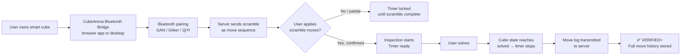

**Supported protocols:**

- GAN i-series: GAN proprietary BLE protocol (documented via reverse-engineering in open-source community; CubeArena will implement)
- Giiker/Xiaomi: public BLE protocol
- QiYi AI series: QiYi BLE protocol
- Future: MoYu AI, any brand adopting the emerging open smart cube protocol standard

**Data available from smart cube:**

- Complete move sequence (all face rotations with relative timestamps)
- Scramble adherence (verified move-by-move before timer starts)
- Solve completion (solved state detected by sensor)
- TPS at each phase of the solve
- Rotation count, AUF detection, slip/pop events

**Browser Bluetooth limitation:** The Web Bluetooth API exists but has device allowlist limitations on some platforms (notably iOS Safari does not support it). CubeArena provides a lightweight "CubeArena Bridge" desktop app (Electron) for users whose browser cannot directly connect to their smart cube. On Android, the native app handles Bluetooth directly.

**Why this is the gold standard:** The smart cube cannot lie. Every move is logged. The scramble cannot be skipped. The solved state detection is hardware-level. Short of physically swapping cubes (detected by connection continuity), the result is essentially unfakeable.

### 8.3 Tier 2: Webcam Computer Vision

For users without a smart cube, the webcam provides a meaningful verification tier — not as granular as move-tracking, but far more trustworthy than honor.

The CV system verifies two things and two things only:

1. **Pre-solve:** The cube matches the assigned scramble (color state confirmed)
2. **Post-solve:** The cube is in the solved state (all faces uniform color)

It does not need to track moves in between. This is a much simpler problem than full move detection and achieves high accuracy with current off-the-shelf models.

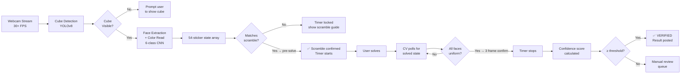

**CV pipeline components:**

_Stage 1 — Cube Detection:_ YOLOv8-M fine-tuned on a synthetic dataset of 500K+ rendered cube images across lighting conditions, camera angles, backgrounds, and hand occlusion. Target: mAP ≥ 0.96.

_Stage 2 — Color Classification:_ MobileNetV3 ensemble per sticker, 6-class (White/Yellow/Red/Orange/Blue/Green). Heavyaugmentation for lighting variation. Classical HSV classifier runs in parallel as a consistency check. Orange/red ambiguity is the hardest case and receives special ensemble handling.

_Stage 3 — State Reconstruction:_ 54-sticker array assembled from face readings. Validated against group-theory constraints (each color appears exactly 9 times; all corner and edge cubies are in legal configurations). Invalid states trigger a flag, not an automatic rejection.

_Stage 4 — Scramble Confirmation:_ Server applies the scramble to a solved state computationally, producing the expected scrambled state. CV output is compared. Timer only starts after confirmed match.

_Stage 5 — Solved State Detection:_ Solved state is the simplest CV task: all stickers on each face the same color. Confirmed over 3 consecutive frames (~100ms at 30FPS) to prevent flickering false positives.

**Inference architecture (hybrid):**

- Client-side (WebAssembly): lightweight cube detection and pre-filter color classification — runs in browser, low latency
- Server-side (GPU): high-accuracy state verification for scramble confirmation and solved-state confirmation
- Only key frames transmitted to server (scramble check frame, solve completion frame); raw video not stored unless flagged

**Latency budget:**

|Stage|Target|
|---|---|
|Cube detection (client)|≤10ms|
|Color classification (client pre-filter)|≤15ms|
|Server state verification|≤80ms round-trip|
|Solved-state frame confirmation|≤100ms (3 frames)|
|**End-to-end: cube solved → timer stops**|**≤150ms**|

150ms is within human perceptual tolerance for a competition context.

**Achievable accuracy estimate:**

- Controlled conditions (good lighting, solid background, proper angle): 94–97% correct state detection
- Average home conditions: 88–93%
- Poor conditions: 78–86% (calibration wizard pushes most users above this floor)

**Training data strategy:**

- Phase 1: Blender-based synthetic dataset, 500K images, procedurally generated (all cube states × angles × lighting × backgrounds × hand occlusion) — ~$5K cloud render cost
- Phase 2: Community opt-in real frames — "donate 100 solves, get 1 month premium"
- Phase 3: Active learning from manual review queue hard cases — weekly fine-tuning cycles

### 8.4 Tier 3: Stackmat Timer Integration

Many serious cubers already own a Stackmat timer from WCA competition prep. CubeArena supports Stackmat via audio jack (the existing method used by CSTimer — the Stackmat produces audio signals at start/stop which are decoded by the browser).

This gives a hardware-verified time but no scramble/solve verification. To count as Tier 2 rather than just a hardware timestamp:

- Stackmat provides the precise time
- Webcam (if active simultaneously) provides scramble and solved-state confirmation
- Combined: Stackmat + Webcam = full Tier 2 verification with millisecond timing precision

### 8.5 Confidence Scoring Framework

Every verified solve receives a confidence score (0.0–1.0) based on CV pipeline output:

|Score|Interpretation|Action|
|---|---|---|
|0.95–1.00|High confidence|Auto-approve, audit log|
|0.85–0.95|Good confidence|Auto-approve, sample review|
|0.75–0.85|Marginal|Auto-approve, flagged for periodic review|
|0.65–0.75|Low confidence|Hold pending manual review (result "pending" 24h SLA)|
|<0.65|Very low|Request re-solve / technical failure|

---

## 9. Anti-Cheat System

Competitive integrity is the product. The anti-cheat system must make cheating harder than it is worth, detectable when it occurs, and handled fairly when detected.

### 9.1 Cheat Taxonomy

#### Physical Cheats

|Method|Description|Smart Cube Detection|CV Detection|Additional|
|---|---|---|---|---|
|Pre-solved cube swap|Keep a second pre-solved cube off-camera, swap when "done"|Bluetooth connection continuity broken; detected immediately|Cube identity tracking via sticker pattern signature|Time-under-threshold flagging|
|Sticker manipulation|Physical sticker repositioning during solve|Full move log shows no path to state|Inter-frame color inconsistency|Continuous state tracking|
|Multiple cubes|Solve a different cube than scrambled|Scramble loaded into specific cube ID|Scramble state confirmed before timer; different cube fails this|Scramble confirmation mandatory|
|Hidden assistant|Another person solves off-frame|N/A|Hand count estimation; body obstruction analysis|Behavioral flagging of unusual speed jumps|
|Non-scramble start|Begin from a partially-solved state closer to solved|Move log shows insufficient moves from scramble|Scramble confirmation gate|Pre-solve state mandatory|

#### Digital Cheats

|Method|Description|Detection|
|---|---|---|
|Video replay|Pre-recorded video of fast solve played in front of webcam|Liveness challenge: random gesture prompt during inspection; depth cues|
|Deepfake|AI-generated video of solve|Temporal consistency analysis; liveness challenge response|
|Virtual camera|Software injecting pre-recorded content via virtual webcam device|Browser getUserMedia API monitoring; virtual device driver detection|
|Frame manipulation|Slowing webcam stream to make fast pre-record appear slower|Server-side frame timing validation against wall clock|
|Client timer hack|Manipulating client-side timer to report shorter time|Timer is fully server-authoritative; client cannot set time|
|Model exploit|Adversarial cube appearance to fool CV into seeing solved state|Adversarial training; ensemble models; behavioral anomaly layer|

#### Metagame Cheats

|Method|Detection|
|---|---|
|Sandbagging|Loss streak analysis; abnormal win/loss patterns|
|Smurf accounts|IP/device fingerprinting; behavioral similarity to flagged accounts|
|Collusion|Network graph analysis: >70% mutual win rate between two players|
|Account sharing|Playtime pattern analysis; device fingerprinting; solve-style distribution changes|

### 9.2 Liveness Challenge System

For webcam users in rated matches, a liveness challenge is issued with 30% probability during the inspection window:

- Display a random simple instruction: "Show your hand palm-up to the camera," "Tilt the cube left," "Hold up two fingers"
- 50+ challenge variants prevent pre-recording all responses
- Failure to respond correctly within 5 seconds: match voided, account flagged for review

### 9.3 Server-Authoritative Timing

The client never controls timing. Flow:

1. Server sends scramble + signed start token
2. Client confirms scramble (via CV or smart cube); server receives confirmation with timestamp
3. Server broadcasts solve-start signal with server timestamp
4. Client signals solve-complete; server receives with timestamp
5. Solve time = (server receive time of solve-complete) − (server send time of solve-start)
6. Network jitter compensation: both players' times are measured by the same server clock, so relative comparison is fair even under varying latency

### 9.4 Behavioral Analytics Layer

Each user accumulates a behavioral profile:

- Solve time distribution: statistical model of expected distribution for given rating
- Outlier detection: times >3σ from personal distribution trigger review flag
- Improvement velocity: rating gains exceeding statistical norms trigger review
- Style fingerprinting: high-level statistical signature of solve pacing patterns (for account-sharing detection)

### 9.5 Community Report System

- Any user flags a specific replay with reason (suspected swap, video replay, time inconsistency, other)
- Reports visible to moderators only
- Reporting abuse: >10 unfounded reports/month triggers throttle

### 9.6 Manual Review Team

Volunteer moderator program (experienced WCA-level cubers):

- Review queue priority: top-rated accounts, flagged accounts, reported solves, tournament results
- SLA: routine queue <72h; tournament results <24h; live events <2h
- Two-reviewer consensus to void; three-reviewer majority for appeals

### 9.7 Sanctions

|Violation|Action|
|---|---|
|First flag, environmental CV issue|Warning + guidance|
|Confirmed cheating, first offense|30-day competitive ban|
|Confirmed cheating, second offense|Permanent ban + public profile badge|
|Organized multi-account cheating|IP/device block + community disclosure|

---

## 10. Match System

### 10.1 Match Types

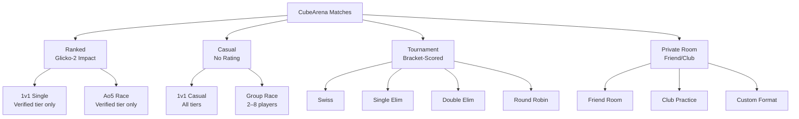

### 10.2 Ranked 1v1 Match Flow

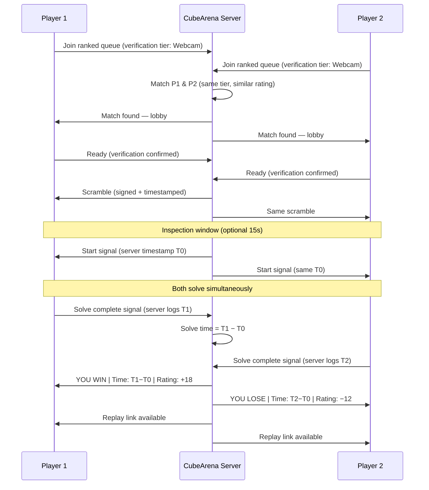

### 10.3 Ao5 Format

Both players complete 5 solves on identical scrambles sequentially. Final result: Ao5 (drop best and worst, average middle 3). Lower Ao5 wins. More representative of actual competition performance than single-solve races. Rating impact from final match result only.

### 10.4 Disconnect Handling

|Scenario|Rule|
|---|---|
|Disconnect during inspection|30s reconnect window; match delayed|
|Disconnect mid-solve; opponent has not finished|60s reconnect window; if unresolved, match voided|
|Disconnect after opponent finishes|Loss recorded|
|CV pipeline failure|30s technical timeout; if unresolved, match rescheduled|
|Smart cube Bluetooth drop|20s reconnect window|

### 10.5 Matchmaking Algorithm

```
function findMatch(player):
    radiusPts = 150
    elapsed = 0
    
    while not matched:
        candidates = queue.filter(
            abs(rating - player.rating) <= radiusPts
            AND event == player.event
            AND verificationTier == player.verificationTier
        )
        
        if candidates:
            match = minBy(candidates, abs(rating - player.rating))
            return match
        
        elapsed += 10s
        if elapsed == 30s: radiusPts = 300
        if elapsed == 60s: radiusPts = 9999 (open)
        if elapsed == 90s AND cross-tier matching enabled:
            expand to adjacent verification tier
        if elapsed == 120s:
            offer casual match or suggest off-peak queue
```

### 10.6 Spectator Mode

- Any live ranked match viewable in spectator mode (player opt-in/opt-out setting)
- 15-second spectator delay to prevent live coaching
- Spectators see: both webcam streams, live timer, player ratings, spectator chat
- Featured matches: highest-rated ongoing matchups surfaced on a "Watch Live" page

---

## 11. Rating System

### 11.1 System Selection

|System|Pros|Cons|Used By|
|---|---|---|---|
|Elo|Simple, well-known|Ignores uncertainty; poor for inactivity|Chess.com (legacy)|
|Glicko-2|Best uncertainty + volatility modeling|More complex to explain|Lichess|
|TrueSkill|Excellent, Bayesian|Microsoft IP; complex|Xbox Live|

**Decision: Glicko-2.** Designed precisely for the failure modes of Elo (inactivity, new player uncertainty, consistency tracking). Used by Lichess, the most trusted free chess platform, lending instant credibility when explained to the speedcubing community. Open specification, no licensing concerns.

### 11.2 Glicko-2 Parameters

|Parameter|Value|Meaning|
|---|---|---|
|Initial μ (rating)|1000|Starting point|
|Initial φ (RD)|350|High uncertainty for new players|
|Initial σ (volatility)|0.06|Standard|
|Rating period|7 days|Weekly recalculation for active players|
|RD ceiling|350|Maximum uncertainty (reached after ~3 months inactive)|
|τ (system constant)|0.5|Controls volatility change rate|

### 11.3 Rank Tiers

|Tier|Rating|Color|Icon|
|---|---|---|---|
|Scrambled|< 600|Gray|◇|
|Beginner|600–800|Bronze|◆|
|Developing|800–1000|Silver|◆◆|
|Competitive|1000–1200|Gold|◆◆◆|
|Advanced|1200–1400|Emerald|✦|
|Expert|1400–1600|Sapphire|✦✦|
|Elite|1600–1800|Amethyst|✦✦✦|
|Master|1800–2000|Ruby|❋|
|Grandmaster|2000+|Diamond|❋❋|

> "Scrambled" as the bottom tier name is a deliberate in-joke for the community — self-aware and welcoming rather than punitive.

### 11.4 Seasonal System

- 90-day seasons
- Seasonal rating = all-time rating regressed 15% toward 1000 at season start
- Top 50 of each season receive permanent season badge
- Off-season (30 days): casual-only; seasonal leaderboard locked

### 11.5 Separate Rating Pools

- **Verified Pool (Tier 1 + Tier 2):** Glicko-2 for all smart-cube and webcam-verified play. This is the "official" CubeArena rating.
- **Per-event Pools (v2):** Separate Glicko-2 for 2x2, 4x4, Pyraminx, etc.
- **Casual Pool:** Unrated. No Glicko-2 impact. Casual leaderboards for fun, clearly labeled unverified.

---

## 12. Technical Architecture

### 12.1 System Diagram

```mermaid
graph TB
    subgraph Clients
        A1[Browser App\nNext.js / React]
        A2[Mobile App\niOS / Android — Phase 6]
        A3[CubeArena Bridge\nElectron — Bluetooth]
    end

    subgraph Edge
        B1[CDN\nCloudflare]
        B2[TURN Server\nCoturn]
    end

    subgraph Core API
        C1[REST API\nFastify / Node.js]
        C2[WebSocket Server\nSocket.io]
        C3[Auth Service\nJWT + OAuth2]
        C4[Matchmaking Service\nRedis queues]
    end

    subgraph AI/CV Service
        D1[CV Inference\nFastAPI + TorchServe]
        D2[GPU Workers\nAWS inf2 / g5]
        D3[Smart Cube\nProtocol Normalizer]
    end

    subgraph Data
        E1[(PostgreSQL)\nPrimary]
        E2[(Redis)\nCache + Queues]
        E3[(R2 / S3)\nReplay Storage]
        E4[(TimescaleDB)\nTime-series Stats]
    end

    subgraph Monitoring
        F1[Prometheus + Grafana]
        F2[Sentry]
        F3[OpenTelemetry]
    end

    A1 --> B1
    A1 --> C1
    A1 --> C2
    A2 --> C1
    A3 --> D3
    D3 --> C2
    C1 --> E1
    C2 --> E2
    C4 --> E2
    D1 --> D2
    C1 --> E3
    C1 --> E4
```

### 12.2 Technology Stack

**Frontend:**

|Component|Technology|Rationale|
|---|---|---|
|Framework|Next.js 14+|SSR/SEO, App Router, strong ecosystem|
|Styling|Tailwind + shadcn/ui|Rapid development|
|3D Cube|Three.js|Scramble preview, 3D replay viewer|
|WebRTC|Native API + simple-peer|P2P webcam streams|
|CV (client)|TensorFlow.js / ONNX Runtime Web|Browser-side pre-filter|
|Charts|Recharts|Rating history, solve charts|

**Backend:**

|Component|Technology|Rationale|
|---|---|---|
|API|Node.js + Fastify|High throughput, TypeScript, great WebSocket|
|WebSocket|Socket.io on µWebSockets.js|Proven at scale|
|Auth|Passport.js + JWT|OAuth2 Google/Discord|
|CV|Python + FastAPI + TorchServe|Python ML ecosystem|
|Queue|BullMQ (Redis)|Review queue, rating calc, async jobs|

**Infrastructure:**

|Component|Technology|
|---|---|
|Cloud|AWS (primary) + Cloudflare|
|GPU|AWS inf2.xlarge / g5 (TorchServe)|
|Containers|Kubernetes (EKS)|
|CDN|Cloudflare|
|TURN|Coturn on EC2|
|IaC|Terraform|
|CI/CD|GitHub Actions + ArgoCD|

### 12.3 Smart Cube Bluetooth Architecture

Browser Web Bluetooth API has limitations (no iOS Safari support; device allowlist). Solution:

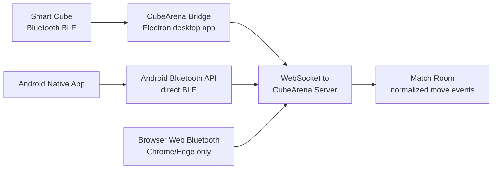

The Bridge is a lightweight Electron app (~5MB download) that handles Bluetooth pairing and streams normalized move events to the CubeArena server. Mobile users pair via the native app. Chrome/Edge desktop users can use Web Bluetooth directly as an alternative.

### 12.4 Scaling Plan

|Phase|MAU|Infrastructure|Est. Monthly Cost|
|---|---|---|---|
|MVP|0–10K|Single-region, small instances, 2× GPU|~$3K|
|Growth|10–100K|Read replicas, Redis Cluster, 4–16× GPU, CloudFront|~$20K|
|Scale|100K+|Multi-region, sharded DB, dedicated GPU clusters|~$80K+|

---

## 13. AI Architecture

### 13.1 CV Model Stack

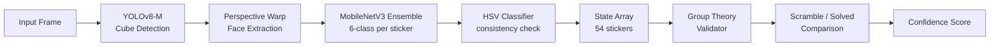

### 13.2 Smart Cube Data Pipeline

Smart cube data is processed differently from CV — it is already digital:

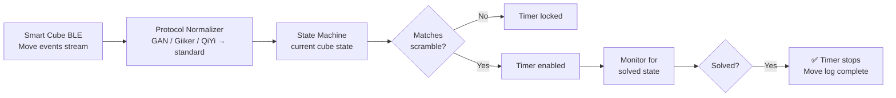

### 13.3 Training Pipeline

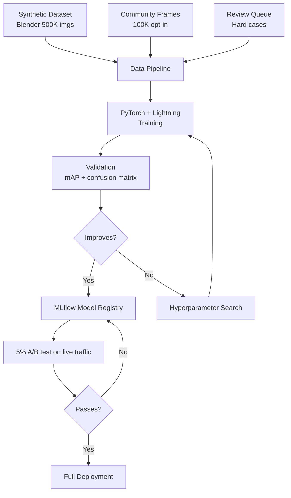

### 13.4 Phase Analysis (v2)

For smart cube solves, the complete move log enables exact phase detection:

- Cross completion: detectable from cube state after first 4 edge moves
- F2L pair insertions: detectable from edge-corner pair states
- OLL: detectable from top-layer orientation state
- PLL: detectable from final layer permutation

For webcam solves, phase detection is approximate — estimated from solve duration and timing patterns rather than exact move tracking.

---

## 14. Database Design

### 14.1 Core Schema

```sql
-- Users
CREATE TABLE users (
    id              UUID PRIMARY KEY DEFAULT gen_random_uuid(),
    username        VARCHAR(32) UNIQUE NOT NULL,
    email           VARCHAR(255) UNIQUE NOT NULL,
    password_hash   TEXT,
    wca_id          VARCHAR(10),
    country_code    CHAR(2),
    avatar_url      TEXT,
    created_at      TIMESTAMPTZ DEFAULT NOW(),
    last_active     TIMESTAMPTZ,
    is_banned       BOOLEAN DEFAULT FALSE,
    role            VARCHAR(20) DEFAULT 'user'
);

-- Ratings (one row per user per event per tier)
CREATE TABLE ratings (
    id              UUID PRIMARY KEY DEFAULT gen_random_uuid(),
    user_id         UUID REFERENCES users(id),
    event           VARCHAR(20) NOT NULL,   -- '333', '222', 'pyram', etc.
    tier            VARCHAR(10) NOT NULL,   -- 'verified', 'casual'
    mu              FLOAT NOT NULL DEFAULT 1000,
    phi             FLOAT NOT NULL DEFAULT 350,
    sigma           FLOAT NOT NULL DEFAULT 0.06,
    provisional     BOOLEAN DEFAULT TRUE,
    updated_at      TIMESTAMPTZ DEFAULT NOW(),
    UNIQUE(user_id, event, tier)
);

-- Rating History
CREATE TABLE rating_history (
    id          UUID PRIMARY KEY DEFAULT gen_random_uuid(),
    user_id     UUID REFERENCES users(id),
    event       VARCHAR(20) NOT NULL,
    tier        VARCHAR(10) NOT NULL,
    mu          FLOAT NOT NULL,
    phi         FLOAT NOT NULL,
    recorded_at TIMESTAMPTZ DEFAULT NOW()
);

-- Matches
CREATE TABLE matches (
    id              UUID PRIMARY KEY DEFAULT gen_random_uuid(),
    match_type      VARCHAR(20) NOT NULL,  -- 'ranked_1v1', 'ao5', 'casual', 'tournament'
    event           VARCHAR(20) NOT NULL,
    scramble        TEXT NOT NULL,
    scramble_seed   TEXT NOT NULL,         -- reproducible audit trail
    format          VARCHAR(20) DEFAULT 'single',
    tournament_id   UUID REFERENCES tournaments(id),
    created_at      TIMESTAMPTZ DEFAULT NOW(),
    started_at      TIMESTAMPTZ,
    completed_at    TIMESTAMPTZ,
    status          VARCHAR(20) DEFAULT 'pending'
);

-- Match Participants
CREATE TABLE match_participants (
    id                  UUID PRIMARY KEY DEFAULT gen_random_uuid(),
    match_id            UUID REFERENCES matches(id),
    user_id             UUID REFERENCES users(id),
    verification_method VARCHAR(20) NOT NULL, -- 'smart_cube', 'webcam', 'stackmat', 'honor'
    result              VARCHAR(10),           -- 'win', 'loss', 'draw', 'void'
    solve_time_ms       INTEGER,
    cv_confidence       FLOAT,                 -- null for smart cube (N/A)
    move_log            JSONB,                 -- move-by-move data from smart cube; null for webcam
    rating_before       FLOAT,
    rating_after        FLOAT,
    replay_id           UUID REFERENCES replays(id)
);

-- Solves (per-solve detail for Ao5 etc.)
CREATE TABLE solves (
    id              UUID PRIMARY KEY DEFAULT gen_random_uuid(),
    match_id        UUID REFERENCES matches(id),
    user_id         UUID REFERENCES users(id),
    scramble        TEXT NOT NULL,
    solve_time_ms   INTEGER NOT NULL,
    verification    VARCHAR(20) NOT NULL,
    cv_confidence   FLOAT,
    move_log        JSONB,
    phase_data      JSONB,  -- Cross/F2L/OLL/PLL timestamps if available
    flagged         BOOLEAN DEFAULT FALSE,
    review_status   VARCHAR(20) DEFAULT 'auto_approved',
    created_at      TIMESTAMPTZ DEFAULT NOW()
);

-- Replays
CREATE TABLE replays (
    id              UUID PRIMARY KEY DEFAULT gen_random_uuid(),
    solve_id        UUID REFERENCES solves(id),
    storage_url     TEXT,           -- R2/S3 for webcam video
    move_log_url    TEXT,           -- R2/S3 for smart cube JSON log
    duration_s      FLOAT,
    public          BOOLEAN DEFAULT TRUE,
    expires_at      TIMESTAMPTZ,
    phase_data      JSONB,
    created_at      TIMESTAMPTZ DEFAULT NOW()
);

-- Tournaments
CREATE TABLE tournaments (
    id                  UUID PRIMARY KEY DEFAULT gen_random_uuid(),
    name                VARCHAR(255) NOT NULL,
    format              VARCHAR(30) NOT NULL,
    event               VARCHAR(20) NOT NULL,
    min_verification    VARCHAR(20) NOT NULL DEFAULT 'webcam',
    organizer_id        UUID REFERENCES users(id),
    max_participants    INTEGER,
    registration_end    TIMESTAMPTZ,
    starts_at           TIMESTAMPTZ,
    prize_pool_usd      INTEGER DEFAULT 0,
    status              VARCHAR(20) DEFAULT 'registration',
    created_at          TIMESTAMPTZ DEFAULT NOW()
);

-- Clubs, Friendships, Achievements, Reports
-- (schemas same as v1 spec; omitted for brevity — see Appendix)
```

### 14.2 Key Indexes

```sql
CREATE INDEX idx_ratings_event_tier_mu ON ratings(event, tier, mu DESC);
CREATE INDEX idx_rating_history_user_event ON rating_history(user_id, event, recorded_at DESC);
CREATE INDEX idx_solves_flagged ON solves(flagged, review_status) WHERE flagged = TRUE;
CREATE INDEX idx_match_participants_user ON match_participants(user_id, match_id);
CREATE INDEX idx_matches_tournament ON matches(tournament_id) WHERE tournament_id IS NOT NULL;
```

---

## 15. API Design

### 15.1 REST API (v1)

**Base URL:** `https://api.cubearena.gg/v1`

**Auth:** JWT Bearer token. OAuth2 via Google/Discord for web; API key for integrations.

```
# Auth
POST   /auth/register
POST   /auth/login
POST   /auth/refresh
GET    /auth/oauth/google
GET    /auth/oauth/discord

# Users
GET    /users/:id
GET    /users/me
PATCH  /users/me
GET    /users/:id/stats
GET    /users/:id/replays
GET    /users/search?q=

# Matches
POST   /matches/queue         body: {event, type, verificationTier}
DELETE /matches/queue
GET    /matches/:id
GET    /matches/live

# Ratings
GET    /ratings/leaderboard?event=333&tier=verified&country=US
GET    /ratings/user/:id

# Tournaments
GET    /tournaments
POST   /tournaments
GET    /tournaments/:id
POST   /tournaments/:id/register
GET    /tournaments/:id/bracket

# Clubs
GET    /clubs
POST   /clubs
GET    /clubs/:id
POST   /clubs/:id/join

# Smart Cube
POST   /devices/register      body: {brandId, deviceId, bluetoothName}
GET    /devices/me
GET    /devices/protocols     returns supported brand list
```

### 15.2 WebSocket Events (Socket.io)

**Namespace: `/match`**

```javascript
// Client → Server
socket.emit('queue:join',         { event, type, verificationTier });
socket.emit('queue:leave');
socket.emit('match:ready',        { matchId });
socket.emit('scramble:confirmed', { matchId, method: 'webcam'|'smart_cube' });
socket.emit('solve:complete',     { matchId, method, confidence?, moveCount? });
socket.emit('spectate:join',      { matchId });

// Server → Client
socket.on('match:found',          { matchId, opponentId, opponentRating, opponentTier, scramble });
socket.on('match:start',          { matchId, serverTimestamp });
socket.on('match:opponent_done',  { matchId, opponentTime });
socket.on('match:result',         { matchId, result, ratingChange, newRating, replayId });
socket.on('queue:status',         { estimatedWaitMs, position });

// Smart Cube Namespace: /smartcube
socket.emit('cube:move',          { deviceId, move, timestamp, cubeState });
socket.on('scramble:load',        { moveSequence });
socket.on('scramble:verified',    { confirmed: true });
socket.on('solve:detected',       { serverTimestamp });
```

### 15.3 Rate Limiting

|Endpoint Group|Free|Premium|
|---|---|---|
|Auth endpoints|10/min|10/min|
|Queue join|5/min|10/min|
|General API|60/min|300/min|
|WebSocket events|30/min|120/min|

---

## 16. Tournament System

### 16.1 Tournament Lifecycle

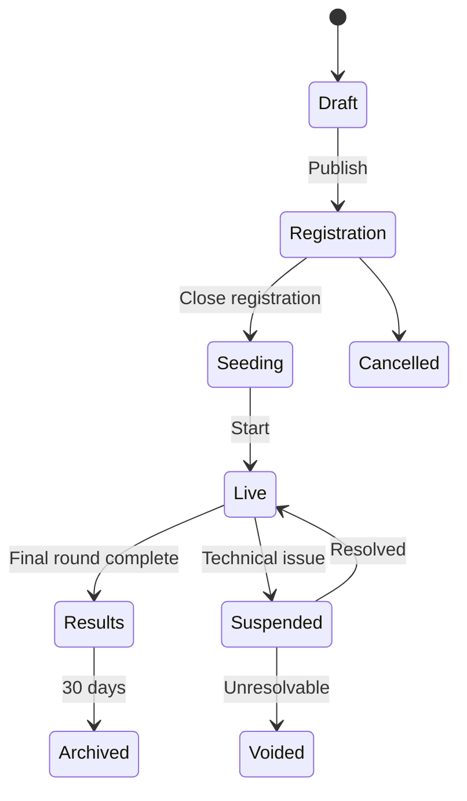

### 16.2 Format Specifications

**Swiss (recommended for 16–256 players):**

- No elimination; maximum matches per player
- Pairing: similar records, no repeat opponents
- Tiebreakers: (1) Buchholz score, (2) Sonneborn-Berger, (3) Solve time
- Minimum verification: configurable per tournament (webcam or smart cube)

**Single Elimination:**

- Best for small events (8–32) and dramatic bracket reveals
- Seeded by CubeArena Glicko-2 at registration close
- Bo3 (Ao5 per game) recommended to reduce single-solve variance

**Round Robin:**

- For clubs (4–12 players), every player vs. every other player once

**League Play:**

- Season-long (4–8 weeks), weekly scheduled matches, final elimination round

### 16.3 Verification Requirements Per Tournament

Tournament organizers set a minimum verification tier:

- **Smart Cube only:** highest integrity; limits entrants to hardware owners
- **Webcam+ (Tier 2 or above):** opens to all webcam users, excludes honor mode
- **Open (all tiers):** community events, casual; results labeled by verification method

Prize-pool tournaments: webcam+ required minimum.

### 16.4 Seeding

1. Verified CubeArena rating → seeded highest to lowest
2. WCA-ranked players without CubeArena rating → seeded after rated players
3. Unranked → random seeding after WCA-ranked players

### 16.5 Prize Distribution

- Platform holds escrow until tournament completes
- 48-hour dispute window post-results
- Distribution via CubeArena balance or Stripe/PayPal payout (ID verification >$50)
- Platform fee: 10% of total prize pool

### 16.6 Broadcast Tools

- Bracket image export (shareable + OBS overlay ready)
- Live bracket embed widget for external websites
- Tournament spectator page with live match viewer
- Match results feed (webhook for external integrations)

---

## 17. Replay & Statistics

### 17.1 Replay Architecture

Replays differ by verification method:

|Method|Replay Contents|
|---|---|
|Smart cube|Move log (JSON), solve time, phase timestamps, 3D reconstruction available|
|Webcam|Video clip (WebM), CV overlay data, confidence scores per frame, solve time|
|Stackmat + webcam|Video clip + precise hardware time + CV state verification|

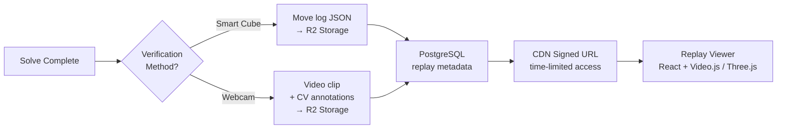

### 17.2 Replay Viewer Features

- **Webcam replays:** Video playback with CV overlay (cube detection box, sticker color confidence), speed controls (0.25×–2×), frame stepping
- **Smart cube replays:** 3D animated cube reconstruction from move log, step through moves, phase markers, TPS curve chart
- Shareable public links; iframe embed support
- Side-by-side comparison (same scramble, two solves)
- AI phase breakdown markers (v2)

### 17.3 Retention Policy

|Tier|Replay Retention|Cap|
|---|---|---|
|Free|90 days|500 replays|
|Premium|1 year|Unlimited|
|Tournament replays|Permanent|N/A|

### 17.4 Personal Statistics Dashboard

```
┌─────────────────────────────────────────────────────────────┐
│  PERSONAL BESTS  (Verified — Webcam / Smart Cube)          │
│  Single: 8.34s    Ao5: 10.21s    Ao12: 11.45s             │
│  Ao50: 12.03s     Ao100: 12.44s  Ao1000: 13.21s           │
├─────────────────────────────────────────────────────────────┤
│  RATING                                                      │
│  Verified Pool: 1,487 (Expert ✦✦)   Peak: 1,512            │
│  Win Rate: 58.3%    Total Matches: 1,247                    │
│  Verification: 71% webcam  |  29% smart cube               │
├─────────────────────────────────────────────────────────────┤
│  CONSISTENCY                                                 │
│  Std Dev (last 100): 1.23s    Coeff. Variation: 9.8%       │
│  Best Streak: 12W             Current Streak: 3W           │
└─────────────────────────────────────────────────────────────┘
```

### 17.5 Advanced Analytics

|Metric|Description|
|---|---|
|Rolling Ao5/Ao12/Ao100|Session sliding window charts|
|PB progression|All-time best improvement over time|
|Phase efficiency (v2, smart cube)|Cross/F2L/OLL/PLL time breakdown vs. peers|
|TPS (smart cube)|Turns-per-second curve per solve|
|Win rate by rating tier|How you perform vs. above/below-rated players|
|Consistency score|Coefficient of variation (lower = more consistent)|
|Improvement velocity|Rating gain per 100 matches|
|Time-of-day performance|Average solve time by hour (for optimal practice scheduling)|
|Verification breakdown|Proportion of results per method over time|

---

## 18. Community Features

### 18.1 Social Layer

- **Friends:** Bidirectional friend graph. See online status, current match, recent results.
- **Following:** Unidirectional follow for top players. Their results in your feed without mutual acceptance.
- **Blocking:** Removes visibility and prevents matchmaking.
- **Activity feed:** Friend/followed PBs, rating tier-ups, tournament wins, notable matches.

### 18.2 Profiles

Public profiles display:

- Avatar, username, country flag, join date
- Rating + tier badge per event (verified pool only; casual clearly labeled)
- Verification method distribution (shows what hardware they use)
- Recent match history, solve history chart
- Achievements and badges
- WCA ID link (optional) → links to official WCA profile
- Club affiliation

### 18.3 Badges & Achievements

|Category|Examples|
|---|---|
|Performance|"Sub-15 Verified", "Sub-10 Verified", "Sub-1min Ao100"|
|Competitive|"First Win", "Win Streak 10", "Season Podium", "Tournament Champion"|
|Hardware|"Smart Cuber" (first smart cube match), "All-Verified" (100 consecutive verified solves)|
|Social|"First Friend", "Club Captain", "Community Reviewer"|
|Loyalty|"30-Day Streak", "500 Solves", "Year One"|

### 18.4 Clubs

- Club creation with name, logo, description, region
- Captain + officer roles
- Club leaderboard, inter-club challenges, private club tournaments
- Club practice rooms with voice chat

### 18.5 Content Creator Integration (v2+)

- CubeArena Partner Program: verified badge, custom tournament branding, revenue share on referred signups
- Twitch Extension: overlay showing cuber's live CubeArena rating + recent match
- One-click replay sharing to YouTube/Twitter
- Audience tournament mode: viewers can enter a creator's custom bracket

### 18.6 Coaching Marketplace (v2+)

- Grandmaster-tier players (or verified WCA competitors) can list coaching
- Session booking + payment in-platform; 15% commission
- Coach reviews student replays and provides annotated feedback via in-platform tools

---

## 19. Monetization Strategy

### 19.1 Core Principles

- **Never pay-to-win.** Premium users get no competitive advantage.
- **Free tier must be genuinely useful.** A free user can play rated matches, track stats, and participate in community tournaments.
- **Transparent pricing.** No dark patterns.

### 19.2 Premium Tiers

|Feature|Free|Pro ($7.99/mo)|Elite ($14.99/mo)|
|---|---|---|---|
|Verified rated matches|✅ Unlimited|✅|✅|
|Events|✅ 3x3 only|✅ All|✅ All|
|Smart cube connection|✅|✅|✅|
|Webcam CV|✅|✅|✅|
|Replay retention|90 days|1 year|Permanent|
|Advanced statistics|❌|✅|✅ + Export|
|Phase analysis (v2)|❌|✅|✅|
|Tournament creation|❌|✅ Small (≤32)|✅ Unlimited|
|Club captain|❌|✅|✅|
|Profile customization|✅ Basic|✅ Extended|✅ Full|
|Ad-free|❌|✅|✅|
|Early feature access|❌|❌|✅|

### 19.3 Cosmetics Shop

- Timer skins, profile backgrounds, avatar frames, cube skins for 3D preview, sound packs
- All purely visual — no competitive effect
- Price range: $1.99–$7.99 per item; $9.99–$24.99 bundles
- Seasonal limited-edition cosmetics (e.g., "WCA Worlds 2027" frame)

### 19.4 Hardware Affiliate Program

Smart cubes are the primary hardware recommendation:

- Affiliate links to GAN, QiYi, MoYu, The Cubicle, SpeedCubeShop
- Contextual placement: after a user's first webcam-verified solve, suggest "upgrade to a smart cube for even better tracking"
- Estimated 5–8% commission on referred purchases; meaningful at scale given smart cube price points ($50–$150)

### 19.5 Sponsorships

- Branded tournaments: GAN Speed Challenge, QiYi Open, etc.
- Co-branded cosmetics (limited-edition GAN-themed timer skin)
- Featured placement on tournament discovery page

### 19.6 B2B Educational

- School/club institutional accounts: $2/student/month, $100/month minimum
- Teacher dashboard, class leaderboard, progress reporting, curated learning path

### 19.7 Revenue Projections (Conservative)

**Year 2 (100K MAU, 5% premium conversion):**

|Stream|Annual|
|---|---|
|Premium subscriptions (5K × $8/mo × 12)|$480,000|
|Cosmetics|$45,000|
|Tournament fees (10% of prize pools)|$10,000|
|Hardware affiliate|$25,000|
|Sponsorships|$50,000|
|B2B educational|$30,000|
|**Total**|**~$640,000**|

**Year 4 (1M MAU, 7% premium conversion):**

|Stream|Annual|
|---|---|
|Premium subscriptions (70K × $9/mo × 12)|$7,560,000|
|Cosmetics|$700,000|
|Tournament fees|$150,000|
|Hardware affiliate|$300,000|
|Sponsorships|$500,000|
|B2B educational|$300,000|
|**Total**|**~$9,510,000**|

---

## 20. Mobile Experience

### 20.1 Mobile Strategy

The web app must be fully responsive from day one. The native mobile app (Phase 6) adds camera-specific optimizations and push notifications not available in the browser.

### 20.2 Camera Setup for Mobile

The biggest mobile UX challenge: hands must be free to solve while the phone captures the cube.

**Recommended setup (shown in setup wizard):**

- Phone propped against wall or stand, angled ~45° down toward cube on table
- Rear camera used (higher quality than front; better depth of field for cube)
- Setup wizard: animated placement guide + live preview with cube placement overlay + "Looks good" confirmation

**Hardware suggestions** (affiliate opportunity):

- Basic adjustable phone stand (~$8–$15) — linked in setup wizard
- Co-branded CubeArena stand as a potential merchandise item

### 20.3 Native App Features (Phase 6)

- Optimized camera (manual exposure lock during solve, auto-focus lock on cube)
- Gyroscope-assisted cube angle guidance
- Direct Bluetooth for smart cube pairing (bypasses the Bridge desktop app requirement)
- Push notifications: match found, tournament round, friend activity, milestones
- Offline practice timer with full stats sync on reconnect
- Home screen widget: current rating, next tournament

### 20.4 Smart Cube Mobile Integration

The native app eliminates the need for the CubeArena Bridge desktop app for mobile users:

- Direct Android/iOS Bluetooth Low Energy API
- All smart cube brands supported through the same normalization layer
- Solve data streamed to server in real time exactly as on desktop

---

## 21. Risk Analysis

### 21.1 Technical Risks

|Risk|Probability|Impact|Mitigation|
|---|---|---|---|
|CV accuracy insufficient for competition trust|Medium|Critical|Extensive beta testing; conservative confidence thresholds at launch; honor mode clearly labeled as fallback|
|Bluetooth protocol reverse-engineering fails for a major brand|Medium|High|Start with GAN (best-documented protocol); add brands incrementally; partner with brands directly|
|WebRTC P2P failure rates too high in restrictive networks|High|Medium|Robust TURN fallback; latency measurement before match; server-relay mode as last resort|
|Scramble desync (players receive different scrambles)|Low|Critical|Server-signed scramble delivery; cryptographic verification; full audit log|
|CV training cost exceeds budget|Medium|Medium|Synthetic dataset minimizes real-world data cost; phased rollout|

### 21.2 Business Risks

|Risk|Probability|Impact|Mitigation|
|---|---|---|---|
|GAN CubeStation improves app and lowers hardware price|High|High|CubeArena's neutral brand positioning and webcam tier are permanent moats; not dependent on any one brand|
|Community resistance: "not official WCA results"|Medium|Medium|Position as complement explicitly; never claim equivalence to WCA; seek WCA regional endorsement|
|Ghost platform problem (not enough users for matchmaking)|High (early)|Critical|Geographic focus at launch; Discord community seeding; private room mode works at any user density|
|Premium conversion too low|Medium|High|Ensure free tier is compelling but premium is clearly valuable; A/B test pricing|

### 21.3 Legal Risks

|Risk|Area|Mitigation|
|---|---|---|
|GDPR/CCPA: webcam data handling|Privacy|Explicit consent; minimal retention; anonymized training data; clear privacy policy|
|Prize distribution regulations|Gaming law|Legal review per jurisdiction; virtual currency pilot before real money|
|COPPA (under-13 users)|Age compliance|Age gate at registration; parental consent for minors|
|Bluetooth protocol legal questions|IP|Community-documented protocols; pursue brand partnerships for official SDK access|

### 21.4 Community Risks

|Risk|Mitigation|
|---|---|
|Toxic competitive culture|Strong moderation; sportsmanship badges; report systems|
|Cheating endemic before anti-cheat matures|Manual review team from day one; conservative thresholds|
|Community fragmentation from WCA|Active engagement with WCA delegates; clear complementary positioning|

---

## 22. Development Roadmap

### 22.1 Gantt Overview

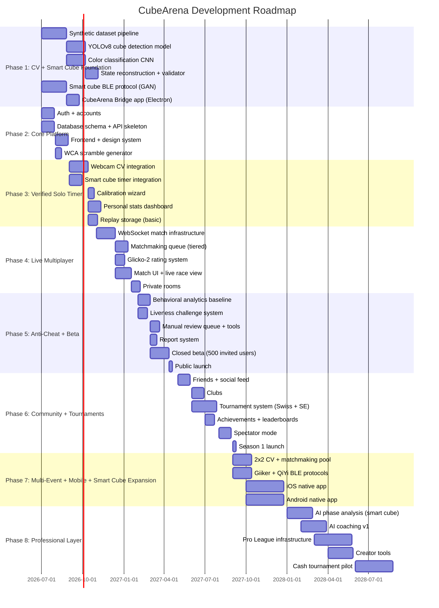

### 22.2 Phase Summaries

**Phase 1 — Foundation (Months 1–3, parallel tracks):** Two tracks run simultaneously: CV model development (cube detection, color classification, state reconstruction) and smart cube integration (GAN BLE protocol, CubeArena Bridge app). These are the core technical risks. Exit criteria: 90%+ CV accuracy in controlled conditions; successful smart cube connection and move logging.

**Phase 2 — Core Platform (Months 1–3, parallel):** Web app skeleton: accounts, auth, database, API, WCA-standard scramble generation, design system. Parallel with Phase 1.

**Phase 3 — Verified Solo Timer (Months 3–5):** A cuber can time themselves with camera or smart cube verification. Like a "verified CSTimer." Even without matchmaking, this is a genuinely useful and deployable product that drives early adoption.

**Phase 4 — Live Multiplayer (Months 5–8):** Two people race, live, with verified results and rated outcomes. The MVP of the competitive platform. Exit criteria: 100 successful verified rated matches in internal testing.

**Phase 5 — Anti-Cheat + Beta (Months 8–11):** Hardening the competitive layer before public exposure. Closed beta with ~500 invited cubers from Discord speedcubing communities, WCA Discord, and cubing subreddits.

**Phase 6 — Community + Tournaments (Months 11–16):** CubeArena becomes a social platform. Clubs, friends, tournaments, leaderboards, Season 1.

**Phase 7 — Multi-Event + Mobile (Months 15–20):** Extend to 2x2, expand smart cube brand support, launch iOS and Android apps.

**Phase 8 — Professional Layer (Months 20–30):** Pro League, cash tournaments, creator tools, AI coaching. CubeArena becomes an esport.

### 22.3 Team & Resource Estimates

|Phase|Core Team|Duration|Est. Cost|
|---|---|---|---|
|1–3 (Foundation + Solo Timer)|2 engineers (1 ML, 1 full-stack)|5 months|$60,000|
|4–5 (Multiplayer + Beta)|3 engineers + 1 designer|6 months|$90,000|
|6 (Community + Tournaments)|4 engineers + 1 designer + moderation|5 months|$120,000|
|7+ (Mobile + Pro)|6+ engineers + 2 designers + T&S|Ongoing|$250K+/year|

**Total to public launch:** ~$270,000 over 11 months. **Funding target:** $500K–$1.5M seed round to reach meaningful community metrics and a Series A.

---

## 23. Stretch Goals & Ambitious Future Features

### 23.1 Full Move Reconstruction from Webcam

The CV system currently verifies start and end states only. A future research direction: reconstruct the full move sequence from camera footage alone.

- Requires tracking individual sticker positions frame-by-frame to infer each rotation
- At sub-5-second solve speeds, moves happen faster than 15ms each — requires high-frame-rate camera (120+ FPS) or predictive tracking
- Research direction: optical flow on sticker regions + legal-move graph search
- **Value:** Enables for webcam users the same phase analysis currently only available for smart cube users
- **Difficulty:** Very high. Likely 18–24 months of dedicated ML research.

### 23.2 3D Replay Viewer (Smart Cube Solves)

Already feasible once move logs exist:

- Reconstruct cube state at each frame from move log
- Render in real-time 3D (Three.js)
- User can orbit, step through moves, view any face angle
- Phase markers on timeline

### 23.3 Open Smart Cube Protocol Standard

CubeArena could lead an industry effort to define an open BLE protocol standard for smart cubes — analogous to USB HID for keyboards. If adopted by GAN, QiYi, MoYu, and others:

- CubeArena becomes the reference implementation
- Any new smart cube works with CubeArena automatically
- Positions CubeArena as neutral infrastructure, not just a product

### 23.4 Team Relay Races

4v4 relay: each player handles one CFOP phase (Cross, F2L, OLL, PLL), handing off to the next player at phase completion detected by smart cube.

- Novel format with strong esports production value
- Requires accurate phase detection and seamless multi-player handoff
- Great for team competition and broadcaster storytelling

### 23.5 AR Cube Overlay (Mobile)

Using ARCore/ARKit for 6DoF cube tracking:

- Overlay solve data on physical cube in real time
- Phase markers projected on cube faces
- "Ghost replay" overlay: ideal-line solve rendered over your current solve as you practice
- Training tool unlike anything on the market

### 23.6 AI Live Commentary

Real-time AI-generated commentary for spectated matches and replay playback:

- Template-driven from phase analysis data: "Incredible F2L efficiency — four pairs in under 6 seconds"
- Multiple styles: excited commentator, analytical breakdown, beginner-friendly explanation
- Synthesized voice or text overlay
- Great for esports broadcasts and replay sharing

### 23.7 Puzzle Variants and New Events

- **FTO (Face-Turning Octahedron):** WCA added this for 2027; CubeArena should support it at launch of the new event
- **Mirror Cube:** Shape-based rather than color-based CV — solvable with depth estimation
- **Clock:** Unique 2D puzzle with different CV challenges; popular WCA event

### 23.8 Blindfold Mode Verification

BLD (Blindfold Solving) verification:

- Confirm blindfold placed before memo ends (face tracking)
- Confirm no peeking during solve
- Verify solved state at end
- One of the hardest CV tasks; requires robust face + occlusion detection

### 23.9 Stackmat + Bluetooth Timer Integration

Many competitors own Stackmat timers. Beyond the audio-jack integration:

- Support for Bluetooth Stackmats (newer models)
- Support for QY Timer and other Bluetooth competition timers
- Combined with webcam: provides millisecond-accurate hardware timing + CV state verification

### 23.10 WCA Partner Integration

Long-term: pursue official relationship with WCA to:

- Allow CubeArena to host WCA-sanctioned online events (if WCA ever creates this category)
- Share scramble generation infrastructure
- Allow CubeArena ratings to appear on WCA profiles as "online rating" (non-official)

---

## 24. Appendix

### 24.1 Key Decisions Summary

|Decision|Choice|Rationale|
|---|---|---|
|Rating system|Glicko-2|Best uncertainty modeling; open spec; Lichess precedent|
|Primary verification|Webcam CV + Smart cube, tiered|Accessibility (webcam) + integrity (smart cube)|
|Scramble generator|WCA random-state for 3x3|Community standard; distinguishes from CubeDesk's random-move|
|Smart cube first brand|GAN (i-series)|Largest user base; best-documented BLE protocol|
|Real-time infrastructure|Socket.io + WebRTC + Redis pub/sub|Proven at scale; matches use case exactly|
|CV inference|Hybrid client/server|Latency (client pre-filter) + accuracy (server confirm)|
|Timer authority|Server-authoritative only|Eliminates client-side time manipulation|

### 24.2 Glossary

|Term|Definition|
|---|---|
|WCA|World Cube Association — governing body for official speedcubing competition|
|Ao5|Average of 5: drop best and worst of 5 solves, average the middle 3|
|CFOP|Cross, F2L, OLL, PLL — the dominant 3x3 solving method|
|OLL|Orientation of the Last Layer — step 3 of CFOP|
|PLL|Permutation of the Last Layer — step 4 of CFOP|
|TPS|Turns Per Second — move execution speed metric|
|RD (φ)|Rating Deviation — Glicko-2 uncertainty measurement|
|Glicko-2|Rating system accounting for uncertainty and volatility|
|BLE|Bluetooth Low Energy — protocol used by smart cubes|
|WCIF|WCA Competition Interchange Format — open standard for WCA competition data|
|BLD|Blindfold — solving the cube with eyes closed|
|Smart cube|A Rubik's Cube with embedded sensors and Bluetooth for move tracking|

### 24.3 Sources

- GAN CubeStation: https://www.gancube.com
- WCA Statistics: https://www.worldcubeassociation.org/results/rankings
- CSTimer: https://cstimer.net
- CubeDesk: https://cubedesk.io
- CubingTime: https://cubingtime.com
- CubingContests: https://cubingcontests.com
- Glicko-2 Specification: Mark Glickman, 2013
- WCIF: https://github.com/thewca/wcif
- YOLOv8: https://github.com/ultralytics/ultralytics
- Chess.com Forum (webcam discussion): https://www.chess.com/forum/view/general/why-are-there-no-webcam-option-in-chat-while-you-play-chess

---

_CubeArena Product Specification v2.0_ _Revised: June 2026_

---

> **"Chess.com didn't invent chess. It built the destination. CubeArena builds the destination for speedcubing — for the community that already exists, the sport that's already being played, and the competition that's been waiting for a home."**